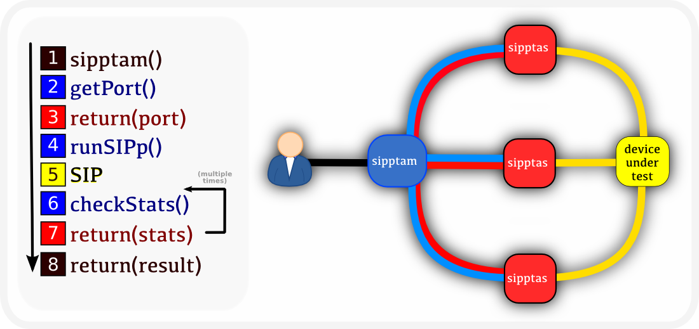

SIPp Test Automation Manager.
=============================

Distributed system to run SIPp instances. 

Author: Luis Martin Gil
*INdigital Telecom*

## Introduction

### SIPp

[SIPp](http://sipp.sourceforge.net/) is a great tool created by HP which allows to generate SIP traffic. A SIPp execution requires an scenario to run, the scenario defines the messages that are going to be sent and received as well as another logic. Multiple parameters can be defined. Also, it has a flexible way to define its highly customizable scenarios.

### Testing your SIP code using SIPp. The need of sipptam

SIPp makes easy to simulate different SIP traffic flows. SIPp is sometimes used as a powerful SIP bulk load tester. The traditional SIPp execution forces the user to run the desired SIPp command manually. The fact of manually run a high number of SIPp commands has obvious disadvantages such as human errors or waste of time. SIPp lacks of ways to automate it. This is where sipptam starts to make sense. If you just have a couple of SIPp scenarios to run against your device under test (SIP UA, SIP proxy, SIP b2bua) manual execution could be allowed, when you have N number of SIPp scenarios and N gets high, you have to look for SIPp automation, sipptam is what you are looking for. **sipptam automates the use of SIPp**.

## How it works

### Yin yang : sipptam (manager) and sipptas (slave).

Three basic type of entities in the {sipptam} world.
- `sipptam`, manager which reads the scenarios and parameters, it distributes the SIPp jobs among the slaves (`sipptas`), checks the status and outputs the result back to the user.
- `sipptas`, slave which performs SIPp jobs. It provides an API for executing SIPp jobs in the box where it is running.
- `dut`, device under test. Device to test such as [asterisk](http://www.asterisk.org/), [opensips](http://www.opensips.org/), [kamailio](http://www.kamailio.org/).



### Scenario execution order

Syncing the execution of scenarios is something that definitely can make the testrun to pass or to fail. Sipptam makes sure the execution is made as the user wants. **The order which scenarios are selected defines the scenarios order execution.** Let's see an example.

#### Example
We have a folder with multiple scenarios:
- `(...)`
- `/tmp/test-0000.xml`
- `/tmp/test-0001_a.xml`
- `/tmp/test-0001_b.xml`
- `/tmp/test-0002_a.xml`
- `/tmp/test-0002_b.xml`
- `/tmp/test-0002_c.xml`
- `/tmp/test-0003.xml`
- `/tmp/test-0004_a.xml`
- `/tmp/test-0004_b.xml`
- `(...)`

A testrun defined with this `scenarioPath="/tmp/test-0002_*.xml"` would select these scenarios:
- `/tmp/test-0002_a.xml`
- `/tmp/test-0002_b.xml`
- `/tmp/test-0002_c.xml`

Again, the order which scenarios are selected defines the scenarios order execution. In this example, `/tmp/test-0002_a.xml` will run first, `/tmp/test-0002_b.xml` will run second and `/tmp/test-0002_c.xml` will run third. The last scenario selected (`/tmp/test-0002_c.xml` in this example) is likely to be the one which sends the first INVITE in the scenario, this way the user makes sure the first two scenarios are already waiting for this INVITE and the testrun is properly syncronized and executed.

### How SIPp instances are binded in the sipptas?

SIPp instances need to bind to a specific port. This port is dynamicaly provided by the sipptas.

#### Tweaking the scenario to get the proper {host, port} from the _tas_:

Scenarios are executed using randomized tas jobs{port and host}. Since most of the scenarios are talking SIP each other we might need to know which is the IP or port of the other scenario in the same testrun. Sipptam provides a way to define this in the scenarios:
* `!sipptas(host( X ))!`
* `!sipptas(port( X ))!`
Where _X_ is an integer which refers to the scenario that is going to be executed in that position.
Based on our previous example,
* `/tmp/test-0002_a.xml`, will be `0`
* `/tmp/test-0002_b.xml`, will be `1`
* `/tmp/test-0002_c.xml`, will be `2`
So if you want to refer to the *ip* and *port* of the tas running the `/tmp/test-0002_a.xml` scenario, we have to refer to it in the other scenarios as *!sipptas(host(0))!* and *!sipptas(port(0))!*.

##### Why would this be useful?

Imagine we have a transfer scenarios using the REFER model, we might have to know where we are referring the call to. In this case we will refer the call to the scenario which is going to be executed in position 2 in the testrun.
``` <![CDATA[
    (...)
    Refer-To: sip:refered_user@!sipptas(host(2))!:!sipptas(port(2))!
    (...)
    ]]>
```

## Execution modes

Different ways to define how the execution is going to be done:
1. `parallel` : All the testruns at the same time.
2. `serial` : Each testrun at a time.

###### Note

_Using parallel mode really makes the different from the manual use of SIPp. This mode allow us to run different scenarios at the same time against the dut. This is not supported by SIPp by any means._

Different ways to define how many executions of the testruns:
1. `tries` : Number of times to execute the same testrun.

Different ways to define the call rate and the maximum number of calls:
1. `ratio` : calls per second. 
2. `max` : maxinum number of calls.

Let's see an example, (notice that t1 defines the end of the execution of the testruns in a parallel mode, t2 is when using serial mode).


# Configuration
Configuration is made through an XML file passed at runtime.

## Example
You can find one [here](resources/sipptam.sample.xml)

## Schema
You can find the **schema** of the XML configuration file [here](src/sipptam/validate/Schema.py)

### \<sipptam\>

* Mandatory. Cardinality : **1**.
* _**sipptam.duthost**_, device under test host
* _**sipptam.port**_, device under test port

```
<sipptam duthost="10.22.22.112" dutport="5060">
```

### \<tas\>
 
* Mandatory. Cardinality : **Unbounded**.
* _**tas.host**_, host to communicate with the tas.
* _**tas.port**_, port to communicate with the tas.
* _**tas.jobs**_, max jobs to assign to this tas.

```
<tas host="10.22.22.200" port="8008" jobs="25"/>
```

### \<testrun\>

* Mandatory. Cardinality : **Unbounded**.
* _**testrun.id**_, identifier for the testrun.
* _**testrun.scenarioPath**_, path where to find the scenarios of the testrun.
* _**testrun.configLink**_, link to the configuration of the testrun. Config must be defined.
* _**testrun.modLink**_, max jobs to assign to this testrun. Mod must be defined. Optional.

```    
<testrun id="test-0001"
	 scenarioPath="/usr/local/share/sipptam/scenarios/test-001*.xml"
    	 configlink="simple"
	 modlink="one"/>
```

### \<config\> 

* Mandatory. Cardinality : **Unbounded**.
* _**config.id**_, identifier for the configlink.
* _**config.ratio**_, semicolon separated list of ratio (SIPp parameter, calls per seconds).
* _**config.max**_, semicolon separated list of calls (SIPp parameter, maximum calls to make).
* _**config.pause**_, seconds to pause between every {ratio, max} combination.
* _**config.tries**_, number of times to execute every {ratio, max} combination.

```   
<config id="advanced"
        ratio="5;10"
        max="20;60"
	pause="5.0"
	tries="2"/>
```


### \<mod\> 
* Optional. Cardinality : **Unbounded**.
* _**mod.id**_, identifier for the configlink.

```     
<mod id="one">
   	 <replace regex="(.*_a.xml)" src="__notusednow1__" dst="tmp1a"/>
	 <replace regex="(.*_a.xml)" src="__notusednow2__" dst="tmp1a"/>
	 <injection regex="(.*)" path="/usr/local/share/sipptam/injections/injection1.sample.csv"/>
</mod>
```

###### \<replace\>

* Optional. Cardinality : **Unbounded**.
* _**mod.replace.regex**_, scenarios from the testrun which match this regex will use this ``replace`` modification.
* _**mod.replace.src**_, string to be replaced in the scenario.
* _**mod.replace.dst**_, string to replace in the scenario.

```     
<replace regex="(.*_a.xml)" src="__notusednow2__" dst="tmp1a"/>
```

###### \<injection\>

Injection modification are used to inject values from external files. Files injectected will be passed with the scenarios that apply. Please check the -inf param of SIPp [here](http://sipp.sourceforge.net/doc/reference.html#Injecting+values+from+an+external+CSV+during+calls).
* Optional. Cardinality : **Unbounded**.
* _**mod.injection.regex**_, scenarios from the testrun which match this regex will use this ``injection`` modification.
* _**mod.injection.path**_, injection file to attach to the .

```
<injection regex="(.*)" path="/usr/local/share/sipptam/injections/injection1.sample.csv"/>
```


### \<advanced\>

* Mandatory. Cardinality : **1**.
* _**advanced.execMode**_, execution mode. parallel will run all the testruns at the same time. serial will run one testrun after another in the way they are defined.
* _**advanced.scenarioValidate**_, checks that all the scenarios loaded in the testruns pass basic XML validation.
* _**advanced.regexValidate**_, checks that the regex defined by the user are correct.

```
<advanced execMode="parallel"
 	  scenarioValidate="False"
	  regexValidate="True"/>
```

# Installation

## Debian package

TODO.

## RPM package

TODO.

## Python Package Index

TODO.
